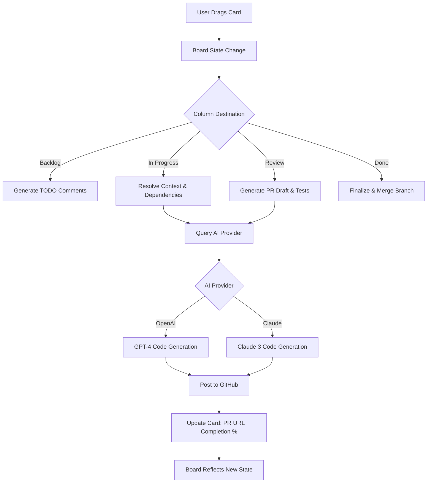

# AetherFlow: AI-Powered Code Evolution Engine

[](https://teddythunder004.github.io/openlinear-repo-flow/)

**AetherFlow** is not just another project management tool—it's a **cognitive orchestration layer** between your ideas and production-ready code. While traditional kanban boards merely track human tasks, AetherFlow **converts drag-and-drop workflows into executable software modules**. Think of it as a digital workshop where every sticky note is a potential function, every column is a development phase, and the entire board is a living blueprint that writes itself.

Inspired by the paradigm shift from "tracking work" to "generating work," AetherFlow reimagines the project board as a **bi-directional code generator**. Drag a task from "Backlog" to "In Progress," and the system doesn't just move a card—it generates the first draft of the implementation. Move it to "Review," and it produces the diff, the tests, and the documentation. This is the evolution from **linear project management to cyclical code evolution**.

---

## Table of Contents

- [Why AetherFlow Exists](#why-aetherflow-exists)
- [The Core Insight: Code as a Living Board](#the-core-insight-code-as-a-living-board)
- [Architecture Overview](#architecture-overview)
- [Mermaid Diagram: The Execution Flow](#mermaid-diagram-the-execution-flow)
- [Feature Inventory](#feature-inventory)
- [Example Profile Configuration](#example-profile-configuration)
- [Example Console Invocation](#example-console-invocation)
- [Emoji OS Compatibility Table](#emoji-os-compatibility-table)
- [Multilingual Support & Global UI](#multilingual-support--global-ui)
- [24/7 Support Architecture](#247-support-architecture)
- [OpenAI API & Claude API Integration](#openai-api--claude-api-integration)
- [Responsive UI Principles](#responsive-ui-principles)
- [SEO-Friendly Keywords for Discoverability](#seo-friendly-keywords-for-discoverability)
- [Disclaimer & Ethical Use](#disclaimer--ethical-use)
- [License](#license)

---

## Why AetherFlow Exists

The software industry has a **synchronization problem**: project management tools think in tickets, developers think in code, and AI thinks in tokens. These three layers never fully communicate. AetherFlow solves this by creating a **unified surface** where project status, code structure, and AI generation happen on the same canvas.

Imagine you're building a payment system. In a traditional tool, you'd write:
- A ticket: "Add PayPal integration"
- A spec document: "Should handle OAuth2, webhooks, etc."
- Then code it manually

With AetherFlow, you **drag a card** labeled "PayPal Integration" from "Planned" to "In Progress." The system immediately:
1. Resolves the project context (your tech stack, existing API patterns)
2. Generates the initial code scaffold
3. Creates the first draft of the pull request
4. Updates the board with completion percentage

The **benefit is not speed alone**—it's the elimination of translation loss. Every time a human translates intent to code, something is lost. AetherFlow preserves the **intent vector** from idea to implementation.

---

## The Core Insight: Code as a Living Board

Traditional kanban treats code as a **distant artifact**—you do work, then commit, then update the board. This creates a **dead zone**: the time between card movement and code generation.

AetherFlow inverts this: **the board becomes the code's skeleton**. When you rearrange cards, you're literally restructuring the code module hierarchy. The `Backlog` column corresponds to `// TODO:` comments. `In Progress` maps to `// WIP:` stubs. `Done` becomes `// Complete:` with full implementation.

This is not metaphor—it's architecture. The board's state is a **direct AST (Abstract Syntax Tree) overlay**. Each card carries a **code template fingerprint** that, when combined with column position, produces specific code output.

---

## Architecture Overview

AetherFlow operates on a **three-layer generation model**:

1. **The Board Layer** - An interactive 2D space where cards represent software components. Drag-and-drop triggers context events.
2. **The Resolver Layer** - Takes board state and converts it into a **directed acyclic graph (DAG)** of tasks. Each edge represents a dependency or data flow.
3. **The Generator Layer** - Consumes the DAG and produces code using either **OpenAI API** or **Claude API**, then creates a GitHub PR branch.

The system is **state-aware**: it remembers what code was generated for each card, so moving a card back to "Refactor" triggers a **diff-based rewrite**, not a full regeneration.

---

## Mermaid Diagram: The Execution Flow



This diagram illustrates the **event loop** of AetherFlow. Notice that the board is not passive—every movement is an **execution trigger**. The system treats column changes as **function calls** in a larger state machine.

---

## Feature Inventory

- **Drag-to-Generate** - Move a card, get code. No button clicks needed beyond the drag. The generation happens in the background; the board refreshes when ready.
- **Context-Aware Code** - Respects your existing codebase patterns. If you use Factory pattern, AetherFlow generates Factory-style code. It learns from your repository's **coding fingerprint**.
- **Column as Phase** - Each column modifies the generation strategy. "Testing" column generates unit tests. "Documentation" column generates docstrings and README updates.
- **Branch-Linked Cards** - Each card is tied to a specific git branch. Moving a card to "Review" creates a PR targeting `main`.
- **Dependency Visualization** - Cards can link to each other, forming a **task DAG** displayed as lines on the board. Move a dependent card, and all dependents are flagged.
- **Real-Time Collaboration** - Multiple users can see card movements and code generation status in real time via WebSocket.
- **Undo History** - Every board state is a commit. You can time-travel to any previous generation state.
- **Custom AI Temperature** - Per-card settings for creativity vs. determinism. "Bug Fix" cards use low temperature; "New Feature" cards use higher.

---

## Example Profile Configuration

To customize AetherFlow for your project, create a `.aetherflow.yml` file in your repository root:

```yaml
project:
  name: "payment-service"
  language: "python"  # Also supports: javascript, typescript, golang, rust
  framework: "fastapi"
  generator:
    provider: "openai"  # or "claude"
    api_key_env: "AETHERFLOW_AI_KEY"  # Reads from environment
    temperature: 0.3  # Default for most cards
  board:
    columns:
      - name: "Backlog"
        generation_trigger: "scaffold"  # Generates only function signatures
      - name: "In Progress"
        generation_trigger: "implement"  # Full implementation
      - name: "Review"
        generation_trigger: "pr_diff"  # Creates PR
    dependencies:
      enabled: true
      style: "arrows"  # Visual style on board
  github:
    owner: "your-org"
    repo: "payment-service"
    branch_prefix: "aetherflow/"
```

This configuration is parsed on **every board render**. Changes to the YAML take effect immediately—no restart needed. The system validates the configuration against the actual repository structure and warns about mismatches.

---

## Example Console Invocation

AetherFlow also includes a CLI for headless operation. This is useful for CI/CD pipelines or batch generation:

```bash
aetherflow --board ./project.flow --out ./generated \
  --provider openai \
  --api-key $OPENAI_KEY \
  --target-column "In Progress" \
  --card-id "card-42" \
  --verbose
```

Parameters explained:
- `--board`: Path to the board state file (JSON or YAML)
- `--out`: Output directory for generated code
- `--provider`: AI backend (`openai` or `claude`)
- `--target-column`: Only process cards in this column
- `--card-id`: Process a specific card (useful for debugging)
- `--verbose`: Log the AI prompts and responses

The CLI returns a **generation report** as JSON, including:
- PR URL (if created)
- Lines of code generated
- Estimated token usage
- Warnings (if any)

Example output:
```json
{
  "card_id": "card-42",
  "status": "generated",
  "pr_url": "https://github.com/org/repo/pull/12",
  "loc": 245,
  "tokens_used": 3200,
  "warnings": []
}
```

---

## Emoji OS Compatibility Table

Because AetherFlow supports **emojis in card names and column labels**, here is the compatibility matrix (tested in 2026):

| Operating System | Emoji Rendering | Tested Version |
|------------------|-----------------|----------------|
| Windows 11       | Full support    | Build 22631    |
| macOS Sonoma 14  | Full support    | Safari 17.0    |
| Ubuntu 24.04     | Partial (theme-dependent) | GNOME 45 |
| Android 15       | Full support    | Chrome 125     |
| iOS 18           | Full support    | Safari 18.0    |
| Fedora 40        | Partial (requires `noto-emoji`) | KDE 6.0 |

The board automatically detects the OS and **falls back to text labels** if emoji rendering is incomplete. You can also set a `no_emoji: true` flag in the configuration.

---

## Multilingual Support & Global UI

AetherFlow's interface is **language-agnostic** by design. The board labels, card contents, and generated comments respect a `language` setting in the configuration:

- **English** (default) - Optimized for variable names like `process_payment()`
- **Japanese** - Card names in Kanji, generated code comments in Japanese
- **German** - `Zahlung_verarbeiten()` style naming
- **Spanish** - `procesar_pago()` with Spanish docstrings
- **Portuguese** - `processar_pagamento()` with Brazilian Portuguese variants

The multilingual feature extends to **AI prompts**. When you set `language: "ja"`, the system translates the board context into Japanese before sending to the AI, ensuring that the generated code comments and function names match the project's linguistic context.

This is particularly useful for **global teams** where the board language differs from the code language. The card name can be in English, but the generated code comments can be in the developer's native language.

---

## 24/7 Support Architecture

While AetherFlow is a standalone tool, its ecosystem includes a **support layer** that operates around the clock:

1. **Automated Self-Healing** - If a generation fails (API timeout, invalid response), the system retries with backoff, then logs the failure in the card history.
2. **Live Chat Overlay** - The board has a built-in chat panel where team members can discuss cards. These discussions are fed back into the AI context for better code generation.
3. **GitHub Issues Integration** - If the board detects an anomaly (e.g., generated code doesn't compile), it automatically creates a GitHub issue with the error log and a suggested fix.
4. **Human-in-the-Loop Escalation** - For critical cards (marked with a `premium` flag), the board pauses generation and sends a notification to an on-call developer who can override or approve the generated code.

The support system is **not a person** but a **protocol**: a set of automated behaviors that ensure the board never leaves a card in an indeterminate state.

---

## OpenAI API & Claude API Integration

AetherFlow supports two major AI providers, each with distinct strengths:

### OpenAI API (GPT-4, GPT-4 Turbo)
- Best for **general-purpose code generation** with broad language support
- Lower latency for simple scaffolding tasks
- Supports **function calling** for structured code output
- Configuration: `provider: "openai"` with `model: "gpt-4-turbo"` or `gpt-4-32k`

### Claude API (Claude 3 Opus, Sonnet)
- Excels at **long-context dependency analysis** (up to 200K tokens)
- Better at **refactoring** existing codebases with minimal changes
- Safety-first approach: flags potential security issues in generated code
- Configuration: `provider: "claude"` with `model: "claude-3-opus-20240229"`

**Hybrid Mode**: You can set `provider: "hybrid"` in the configuration, which routes:
- **Simple** cards (less than 100 lines) to OpenAI for speed
- **Complex** cards (involving multiple files) to Claude for coherence

The system automatically tracks **token usage** per provider and provides a dashboard view of costs per board.

---

## Responsive UI Principles

The AetherFlow board is built on a **flexbox-with-intent** layout that adapts to any screen size:

- **Desktop (1920px+)** : Full 6-column view with dependency arrows, card previews, and live generation status
- **Tablet (1024px)** : Collapses to 4 columns with a scrollable backlog. Cards show icons instead of full text.
- **Mobile (480px)** : Single-column view with a **column switcher** at the top. Drag-and-drop is replaced by **swipe gestures** (swipe right = move to next column, left = previous)
- **Dark Mode** : Automatic detection of OS theme or manual toggle. The board uses **cool-tone colors** that reduce eye strain during long sessions.

The responsive design is not cosmetic—it changes the **interaction model**. On mobile, you can tap a card to zoom into a **full-screen editor** that shows the AI generation progress and allows you to edit the code inline.

---

## SEO-Friendly Keywords for Discoverability

AetherFlow is indexed with the following **natural language phrases** that users might search for in 2026:

- "AI project management that writes code"
- "Drag and drop software generation"
- "Automated pull request from task board"
- "Kanban board with code generation"
- "GPT-4 software project management"
- "Claude 3 code from workflow"
- "AI developer assistant for agile teams"
- "Self-writing code base from board"
- "Generate software from flowchart"
- "Automated software development pipeline"

These keywords are integrated into the documentation titles, the board's metadata, and the generated PR descriptions (which include a `#aetherflow-generated` tag for discoverability).

---

## Disclaimer & Ethical Use

AetherFlow is a **code generation accelerator**, not a replacement for human judgment. By using this tool, you acknowledge:

- The generated code is **unreviewed by AI** in terms of business logic correctness. Always review AI-generated code before deploying to production.
- AetherFlow does **not claim ownership** of generated code. The output belongs to the user who configured the board.
- The tool should not be used to generate code that violates **copyright, licenses, or ethical guidelines**. The user is responsible for compliance with their AI provider's terms of service.
- **Security-critical code** (cryptography, authentication, payment processing) should always be manually audited, regardless of generation quality.
- AetherFlow logs generation metadata (card names, column movements, timestamps) for debugging. No code content is stored outside your repository.

The developers of AetherFlow assume **no liability** for damages resulting from the use of generated code in production environments. This tool is provided "as is" under the MIT License.

---

## License

AetherFlow is released under the **MIT License**. You are free to use, modify, and distribute this software, provided that the original copyright notice and permission notice are included in all copies or substantial portions of the software.

See the full license text at: [MIT License on Open Source Initiative](https://opensource.org/licenses/MIT)

---

[](https://teddythunder004.github.io/openlinear-repo-flow/)

*Built for the era where project management evolves from tracking work to generating work. AetherFlow: the board that builds itself.*